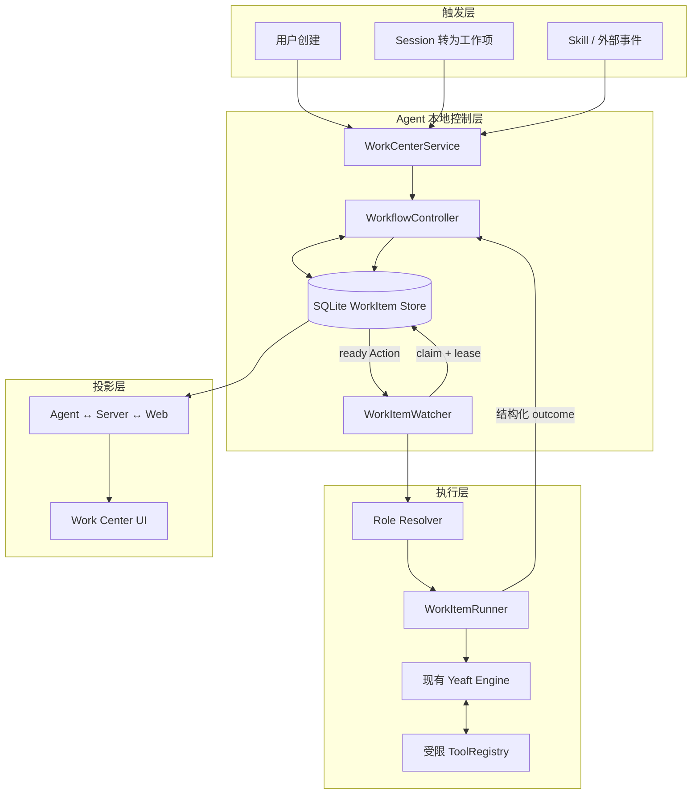

# Work Center 架构

## 总体流程

## Scope 决策

WorkItem 是 per-agent，不是 per-session。

- Agent 拥有 workDir、VP library、模型配置、工具、Watcher 和本地日志。
- Session 可能被关闭、删除或切换，但长期工作不能因此丢失。
- 同一个 WorkItem 可以被多个 Session 讨论；`originSessionId` 保留首次来源，`linkedSessionIds` 表示后续关联。
- Web 通过 `agentId` 查询对应 Agent 的 Work Center。Agent 离线时只能显示 Web 已缓存的 agent 元数据，不能伪造本地 WorkItem 数据。

## 模块职责

### WorkCenterService

面向 wire/API 的应用服务。负责输入校验、调用 Store/Controller、生成快照和事件广播。Agent boot 时启动 Watcher，不依赖浏览器首次访问；Session UI 和 `CreateWorkItem` tool 共用同一 Producer API。

### WorkItemStore

SQLite 是唯一事实源，负责 WorkItem、Action、Run 和 Event 的事务写入。claim 必须在单事务内更新 `currentRunId`、`leaseEpoch` 和 Action 状态；terminal submit 必须在单事务内更新 Run、Action、WorkItem、下一 Action 与 Event。

### WorkflowController

唯一允许推进领域状态的模块。执行结果到下一 Action 的映射：

- `completed`：创建流程中的下一 Action；最后一个 Action 完成后 WorkItem → `done`。
- `waiting`：WorkItem → `waiting`，当前 Run 结束；恢复时创建新 Run。
- `retryable`：在重试上限内 Action → `ready`；否则 WorkItem → `needs_attention`。
- `failed`：WorkItem → `needs_attention`，禁止盲目自动重跑。
- `triage completed`：可提交受验证的 contract patch；阶段 summary/evidence/decision 作为下一 Action context 持久化。
- `review completed`：必须明确 `approved|changes_requested`，缺失决定绝不进入 deliver。

### WorkItemWatcher

轮询 ready Action、原子 claim、续租并调用 Runner。进程启动时把旧 bootId 或过期 lease 的 running Run 收敛为 `interrupted`，再按策略 ready/needs_attention。

### WorkItemRunner

将 `requiredRole` 映射到 VP profile，创建一次隔离的 Engine Run，持久化 role/VP/model/tool-policy 快照，收集事件并提交结构化 outcome。角色缺失直接失败，不回退 omni。V1 禁止 MCP、后台 Bash、子 Agent、RouteForward、AskUser 和递归 CreateWorkItem；等待用户通过 `waiting` outcome 表达。

Runner 的路径 realpath 检查会拒绝文件工具的 symlink escape，但 Bash 的固定 cwd 不是安全沙箱。V1 threat model 是可信 Agent；若需要抵御恶意或 prompt-injected shell，必须把整个 Run 放入 container/sandbox。WorkItem Engine 不写 Session conversation、memory archive、exec-log 或共享 tool stats。

## 与现有系统的关系

| 现有能力 | Work Center 用法 |
| --- | --- |
| Yeaft Engine | 复用 query loop、LLM router、工具执行和 abort |
| VP library | 作为角色模板来源 |
| Session | origin/link；不是 owner |
| Session TaskManager | 不复用；它只管理进程型后台作业 |
| worktree 工具 | V1 由 Action 的 workDir/Runner 决定；不在 Store 内管理第二套 workspace |
| 并发 | V1 每个 Agent 串行执行一个 Run，避免多个 WorkItem 并发写同一项目目录；引入独占 workspace lease 后才能放开并行 |
| Server | 纯鉴权和 WebSocket relay，不复制 Agent 本地工作项数据库 |
